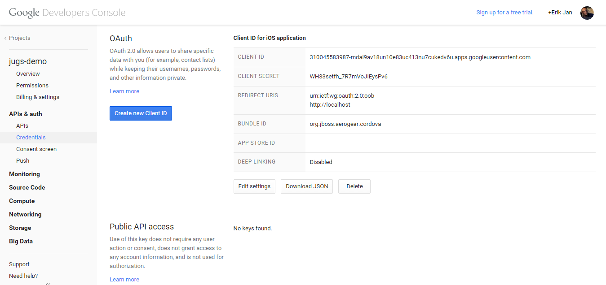

# Shoot 'n Share
---------
Authors: Erik Jan de Wit (edewit)   
Level: Advanced  
Technologies: Cordova, iOS, Android    
Summary: And example of interacting with several modern web services.  
Target Product: -     
Product Versions: -     
Source: https://github.com/aerogear/aerogear-cordova-cookbook/tree/master/Shoot   

## What is it?

You want to shoot cool photos and share them with friends using GoogleDrive, Facebook or your own Keycloak server. With ShootnShare you can take picture, browse your camera roll, pick a picture to share and share it! Picture get uploaded to your GoogleDrive, keycloak and/or facebook

## How do I run it?

### 0. System Requirements

* [Cordova 4.2](http://cordova.apache.org/)

### 1. Service Requirements

#### Google Account Setup

First, you must authenticate with Google. You will need a Google Account for this. Now open the [Google Console](http://console.developer.google.com).

If you haven't created a project, click "Create Project" and give the new project a name:


Now you need to enable the Drive API. To do that, navigate to APIs & auth > APIs and scroll down to the Drive API item, which you need to turn on:


Now you need create new credentials to access your Drive accounts from the app. Go to APIs & auth > Credentials and inside OAuth area click the blue `Create new Client ID` button. 


You will need to create a _consent screen_. Click the blue `Configure consent screen`


Afterwards, click save and you will return to the Client ID. Select `Installed application` and `Other`:


On the last screen we finally get to see the actual value of the generated `client id`, `secret id` and `redirect uris`, which you will use later:



#### Facebook Account Setup

First you must have a Facebook account.  Now open the [Facebook Developers](https://developers.facebook.com/) page and select `Apps` -> `Add a New App`


Click `www`


Click `Skip and Create App ID`


Setup a Display Name and Namespace and select a category, then click `Create App ID`


Fill out the captcha

You are now on the Dashboard view. Make a note of your `App ID` and `App Secret`.


Select `Settings` from the sidebar and then the `Advanced` tab


Scroll to Security and enable `Embedded browser OAuth Login` and make `https://localhost/` your redirectURI


Now save your changes and Facebook is ready to go.

#### Keycloak and Shoot Server Setup

Please refer to [aerogear-backend-cookbook shoot recipe](https://github.com/aerogear/aerogear-backend-cookbook/tree/master/Shoot).

### 2. Application Setup

To use this project as is, first clone the repo from GitHub, then run:

```bash
$ cordova restore plugins --experimental
$ cordova platform add ios android
```

#### iOS setup

```bash
$ cordova prepare ios
$ open platforms/ios/Shoot.xcodeproj/
```

* Apply iOS Swift workaround. See details instruction in [aerogear-oauth2-cordova](https://github.com/aerogear/aerogear-oauth2-cordova/blob/master/README.md#workaround-for-ios).
* Open `www/js/app.js` and update `clientId` and `clientSecret` with your `App ID` and `App Secret`
* For `Facebook` also change `fbYYY` to `fb<App ID>` in the Shoot-Info.plist

```xml
<key>CFBundleURLTypes</key>
    <array>
        <dict>
            <key>CFBundleURLSchemes</key>
            <array>
                <string>org.aerogear.Shoot</string>
                <string>fbYYY</string>
            </array>
        </dict>
    </array>
```


#### Android setup

